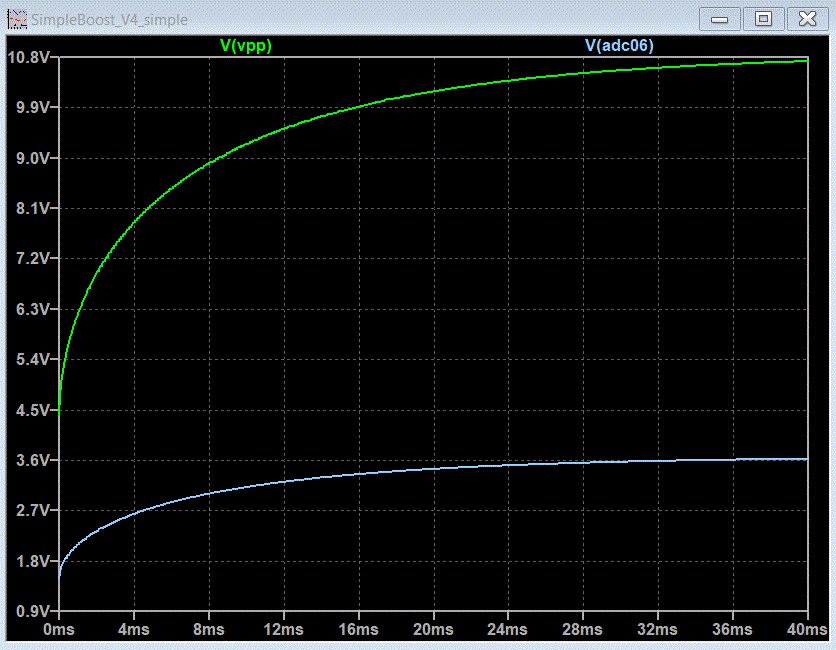
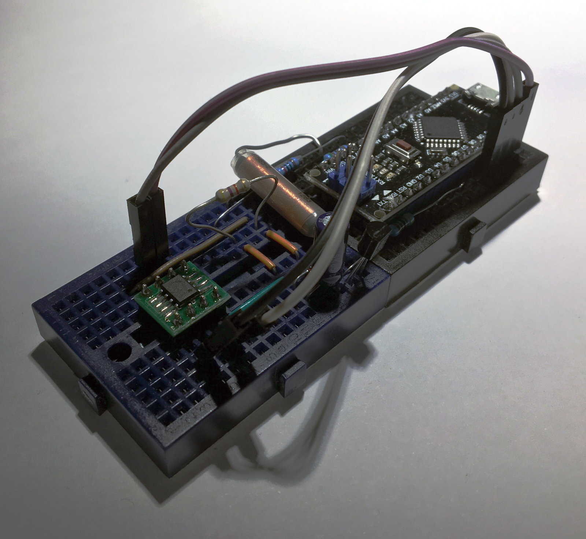

# Hardware

Experimental programmer hardware based on an Arduino Nano with a ATMega168PA. 

The programming interface of the MCU is directly connected to GPIO of the ATMega as shown below. Also VDD is controlled by a GPIO. Maximum load on VDD is 20mA according to the PMS150C datasheet, which can be easily sourced from the ATMega. Vpp is generated with a simple boost converter.

	     6-wire    5-wire
	PWM = VPP     = ICVPP
	PB0 = VDD     = VDD  
	PB1 = MISO    = ICPDA      (data output of MCU or bidirectional)
	PB2 = MOSI    = Not used   (data input of MCU)
	PB3 = SCLK    = ICPCK 
	
	PA6 = ADC6 = voltage monitor input (5k1/10k divider)

This is a minimal hardware implementation and is not representative of a production worthy programmer. See below for open issues.

## Boost converter to control Vpp

The programming voltage Vpp is generated with a simple boost converter that is controlled directly by the periphery of the ATMega. The circuit and a LTspice simulation is shown in the images below. This concept was previously used in the Openprog PIC programmer and is also used in the official PICkit by Microchip. See [here](http://openprog.altervista.org/OP_eng.html#Regulator) for more details.

Timer TC0 is used in fast PWM mode to generate a 62.5 kHz square wave on the input of the switching transistor. The duty cycle of the PWM signal is varied to modify swithing. The voltage across the load is divided with R1 and R3 and fed back into the ADC of the ATMega. Right now the voltage in the programmer is not controlled in a closed loop, therefore changes of the load lead to a deviation of Vpp. To reduce the impact of varying load, a constant loading resistor was added. This may be merged with the voltage divider.
A 1N4148 PN junction diode with ~0.7 Vf drop is used intentionally to reduce the standby voltage of the switching converter to below 5.0 V. 

## Open issues

 - To properly implement the programming sequence, including corner case verification, it is also necessary to control the voltage of VDD from 2 V to 6.5 V. This requires additional hardware.
 - Control of VPP is somewhat instable and has a slow step response. This could be improved with a closed loop converter or a dedicated boost converter IC.

### Circuit

### Simulation 

### Breadboard

